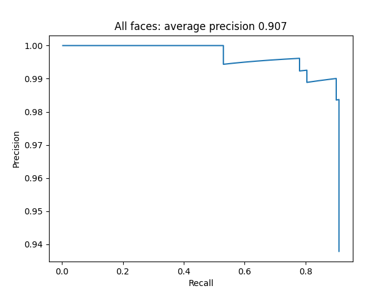
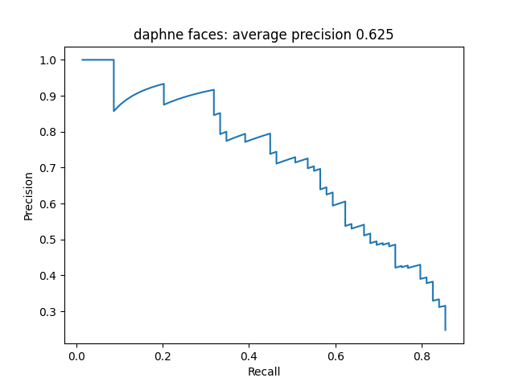
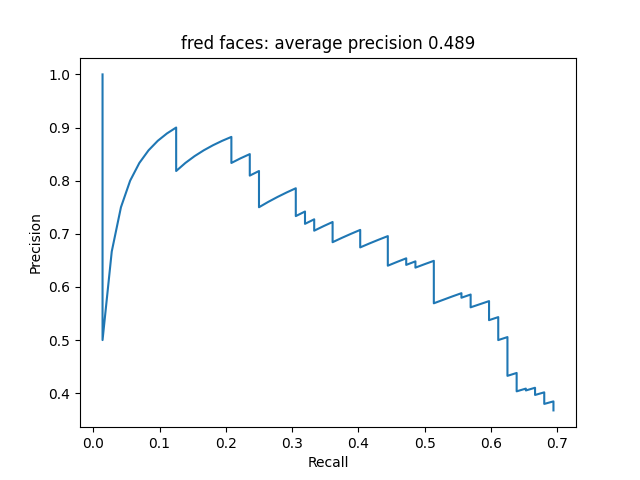
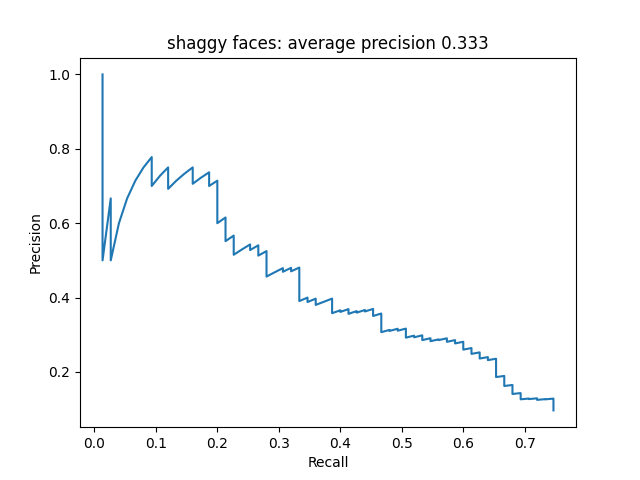
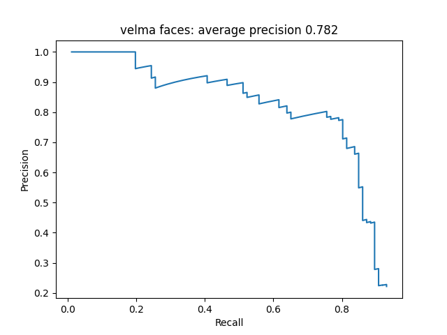

# Scooby-Doo Face Detection & Character Recognition

This project implements a complete pipeline for detecting and identifying the main characters from the **Scooby-Doo** animated series. It explores two distinct approaches: a **Classical Machine Learning** pipeline using HOG descriptors and SVM classifiers, and a **Modern Deep Learning** approach using YOLO.

## 📋 Table of Contents

- [1. Dataset Creation & Augmentation](#1-dataset-creation--augmentation)
- [2. Classical CV Pipeline (HOG + SVM)](#2-classical-cv-pipeline-hog--svm)
- [3. Character Recognition (Task 2)](#3-character-recognition-task-2)
- [4. Bonus: YOLO Implementation](#4-bonus-yolo-implementation)
- [5. Results & Evaluation](#5-results--evaluation)
- [Installation & Usage](#installation--usage)

---

## 1. Dataset Creation & Augmentation

The foundation of the project is a dataset of **6,547 positive examples** extracted from 4,000 ground-truth annotated images.

- **Positive Samples:** Faces were cropped and resized to a standard $36 \times 36$ pixel window.
- **Negative Samples:** Manually curated to include diverse backgrounds and "hard negatives" (round objects, non-face textures, and specific body parts of Scooby-Doo to prevent false positives).
- **Data Augmentation:** To improve robustness, the positive set was expanded using:
    - Random rotations ($-5^\circ$ to $+5^\circ$).
    - Brightness and contrast adjustments ($\alpha$ and $\beta$ parameters).
- **HOG Extraction:** The system handles various patch sizes by resizing them to $36 \times 36$ before extracting Histogram of Oriented Gradients (HOG) descriptors.

---

## 2. Classical CV Pipeline (HOG + SVM)

The detection system relies on a sliding window paradigm paired with a linear classifier.

### Sliding Window & Image Pyramid

Instead of using multiple window sizes, the system uses a fixed $36 \times 36$ window and resizes the input image iteratively with a **0.9 scale factor** until the image dimensions fall below the window size. This creates an image pyramid that allows for multi-scale detection.

### Classifier Tuning

- **SVM:** The `LinearSVC` model was trained with `class_weight='balanced'` for character recognition to account for the disparity between positive and negative sample counts.
- **NMS (Non-Maximal Suppression):** The overlap threshold was tuned to **0.15** (reduced from 0.3) to aggressively eliminate overlapping false positives and keep only the strongest detection per face.

---

## 3. Character Recognition (Task 2)

For individual character identification (Daphne, Fred, Shaggy, Velma), specific models were trained:

- **Positive Set:** Faces of the target character.
- **Negative Set:** Faces of the other three characters, "Unknown" characters, and general background samples from Task 1.

---

## 4. Bonus: YOLO Implementation

As a modern alternative, a **YOLO** (You Only Look Once) model was trained on the dataset.

- **Training:** 100 epochs (approx. 2 hours on an RTX 3050 GPU).
- **Format:** Annotations were converted to the YOLO standard `.txt` format.
- **Performance:** Significantly outperformed the classical HOG+SVM approach in both precision and recall.

---

## 5. Results & Evaluation

Performance is evaluated using **Precision-Recall (PR) curves** for each task and character.

### Task 1: All Faces (SVM vs. YOLO)

<table>
  <tr>
    <td align="center"><br/><sub><b>SVM Precision-Recall</b></sub></td>
    <td align="center"><br/><sub><b>YOLO Bonus Precision-Recall</b></sub></td>
  </tr>
</table>

### Task 2: Character-Specific (SVM)

The following graphs show the detection performance for each member of the Mystery Inc. gang using the SVM approach:

<table>
  <tr>
    <td></td>
    <td></td>
    <td></td>
    <td></td>
  </tr>
  <tr>
    <td align="center"><b>Daphne</b></td>
    <td align="center"><b>Fred</b></td>
    <td align="center"><b>Shaggy</b></td>
    <td align="center"><b>Velma</b></td>
  </tr>
</table>

---

## 🚀 Installation & Usage

### Requirements

- **Python:** 3.10.9
- **Core Libraries:** OpenCV (4.11.0), NumPy (2.2.3), Matplotlib (3.10.8), Scikit-learn (1.8.0)
- **Deep Learning:** PyTorch (2.7.1+cu118), Ultralytics/YOLO (8.3.248)

### Running the Project

1.  **Classical Pipeline (Task 1 or 2):**
    Navigate to the specific task folder and run:
    ```bash
    python RunProject.py
    ```
2.  **YOLO Bonus:**
    Navigate to the `Bonus` directory and run:
    ```bash
    python generare_rezultate_finale.py
    ```

**Note:** The trained models and descriptors are included. To retrain from scratch, clear the contents of the `data/salveazaFisiere` directory.

---

**Author:** Rizea Mihai-Marius
