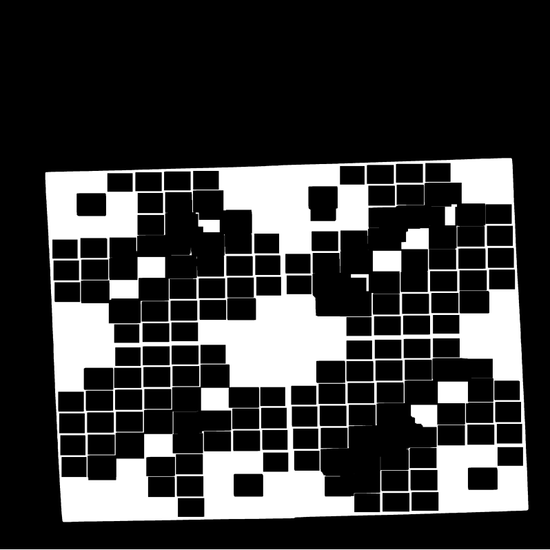
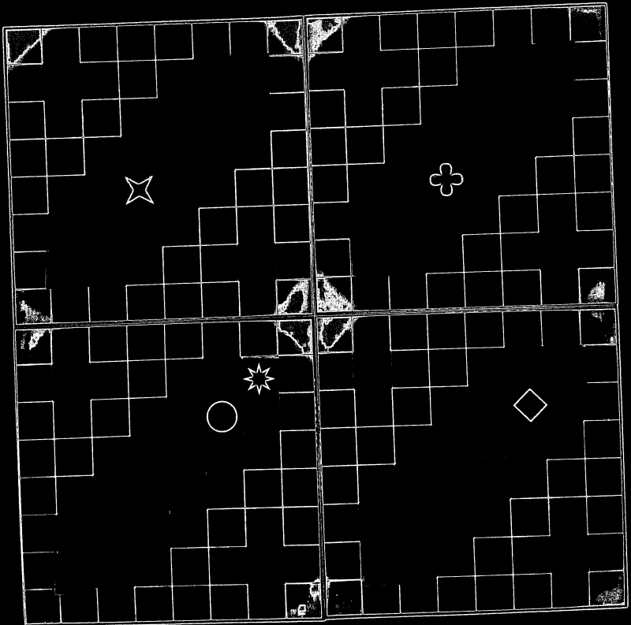
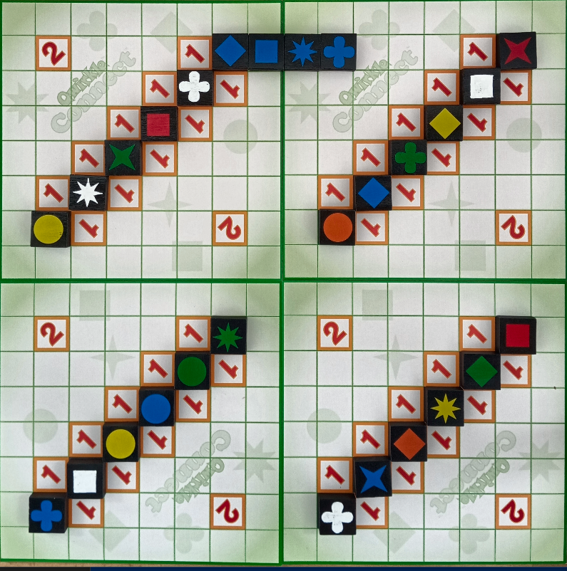
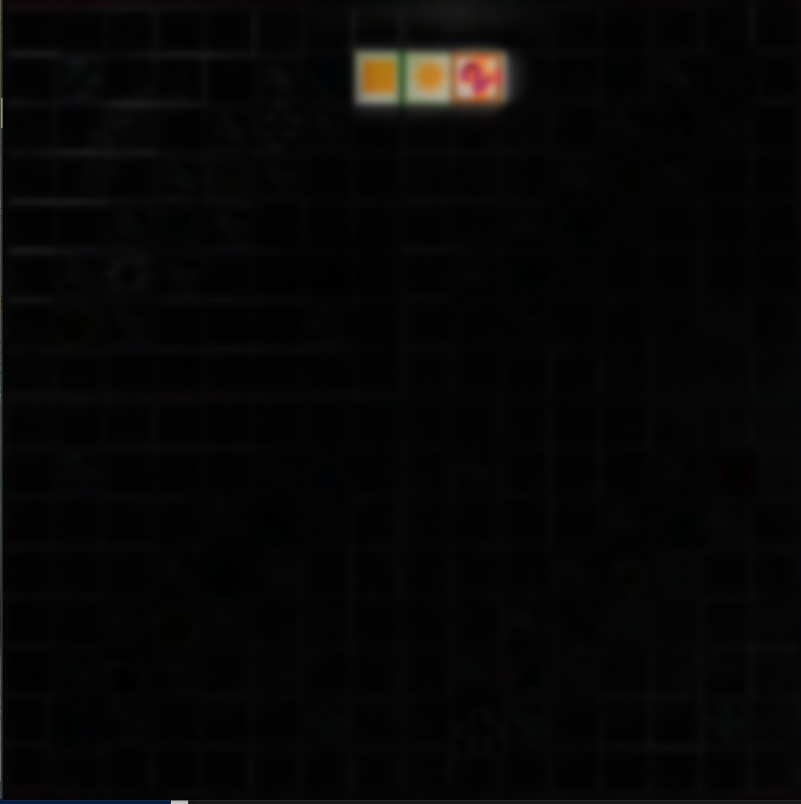
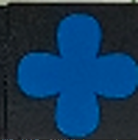

# Qwirkle Vision System - Automated Referee

This project implements a complete Computer Vision pipeline designed to automatically analyze, track, and score a **Qwirkle** board game session. Using Python and OpenCV, the system processes sequential images to detect the board, identify piece attributes (color and shape), and enforce game rules.

---

## 🛠 1. Board Pre-processing

The first stage isolates the board and corrects its perspective to a standard $800 \times 800$ pixel grid.

- **Lighting Normalization:** Uses the **CLAHE** (Contrast Limited Adaptive Histogram Equalization) algorithm on the **L** channel (Lab color space) to ensure consistent color detection regardless of room lighting.
- **Board Localization:** Identified via **HSV segmentation** for green hues followed by morphological closing to unify the board surface.
- **Perspective Warp:** Maps the four detected corners to a square grid, where each game cell is exactly $50 \times 50$ pixels.

<table>
  <tr>
    <td align="center"><br/><sub><b>Board Mask</b><br/>(HSV + Morphology)</sub></td>
    <td align="center"><br/><sub><b>Grid Detection</b><br/>(Corner identification)</sub></td>
    <td align="center"><br/><sub><b>Warped Result</b><br/>(Final 800x800 grid)</sub></td>
  </tr>
</table>

---

## 🔍 2. Initial Configuration

At game start, the system determines the pre-existing diagonal setup:

- Analyzes the 4 main quadrants ($16 \times 16$ grid).
- Compares the average brightness (HSV-V channel) of patches on the main vs. secondary diagonals.
- The diagonal with lower intensity values (higher contrast) is marked as the active starting line.

---

## ⚡ 3. Move Detection (Motion Analysis)

Newly placed pieces are detected by comparing the current "warped" frame with the previous state.

1.  **Frame Differencing:** Calculates `cv2.absdiff` between frames.
2.  **Noise Reduction:** Applies a $23 \times 23$ Gaussian Blur to eliminate alignment discrepancies.
3.  **Dual-Threshold Decision:**
    - **High Threshold (> 70):** Instant detection as a new piece.
    - **Low Threshold (60-70):** Validated by checking if the intensity mean difference between the old and new patch exceeds 30.

<p align="center">
  <br/>
  <sub><i>Detected pieces extracted from the difference map</i></sub>
</p>

---

## 🎨 4. Color Classification

Colors are identified in the **HSV space**. To handle off-center placements, the algorithm samples 5 points: the geometric center and 4 inner corners (10px offset).

| Color      | Hue (H)                   | Saturation (S) | Value (V)    |
| :--------- | :------------------------ | :------------- | :----------- |
| **White**  | -                         | $< 55$         | $> 110$      |
| **Yellow** | $[21, 35]$                | $[60, 255]$    | $[100, 255]$ |
| **Orange** | $[3, 20]$                 | $[65, 255]$    | $[100, 255]$ |
| **Blue**   | $[80, 135]$               | $[100, 255]$   | $[80, 255]$  |
| **Green**  | $[28, 79]$                | $[30, 255]$    | $[40, 220]$  |
| **Red**    | $[0, 10] \cup [160, 180]$ | $[80, 255]$    | $[80, 255]$  |

---

## 🔷 5. Shape Recognition

Recognizes the 6 Qwirkle shapes (Circle, Square, Diamond, Clover, 4-Star, 8-Star) using **Template Matching** with rotation invariance.

1.  **Pre-processing:** 4x Upscaling (Cubic interpolation), Otsu's Binarization, and Centering via image moments.
2.  **Matching:** Uses `cv2.TM_SQDIFF_NORMED` comparing the patch against a template database.
3.  **Rotation Invariance:** Rotates the input patch between $-3^\circ$ and $+3^\circ$ to find the absolute best fit.

<table>
  <tr>
    <td align="center"><br/><sub><b>Original Patch</b></sub></td>
    <td align="center"><br/><sub><b>Processed Shape</b><br/>(Binarized & Centered)</sub></td>
  </tr>
</table>

---

## 🏆 6. Game Logic & Scoring

The system implements the full scoring engine:

- **Bonus Matrix:** Generates a map of special points (+1 or +2) based on the initial diagonal configuration.
- **Line Validation:** Checks for continuous horizontal and vertical lines formed by new moves.
- **Qwirkle Bonus:** Automatic +6 points awarded for completing a sequence of 6 unique pieces.

---

## 🎁 Bonus: Evolution Tracking

A specialized module designed to track game evolution by estimating tile size at ~165 pixels. It establishes a dynamic origin $(0,0)$ from the leftmost piece and updates a global coordinate map, allowing the system to track the game even without a fixed board grid.

---

## 🚀 Installation & Usage

### Requirements

- **Python:** 3.10.9
- **Libraries:** OpenCV (4.11.0), NumPy (2.2.3)

### Running the Scripts

To process a standard game sequence:

```bash
python script.py -i "input_folder" -o output -t templates
```

### To run the bonus tracking module:

```bash
python bonus.py -i "bonus_folder" -o output -t templates
```

### Author: Rizea Mihai-Marius
